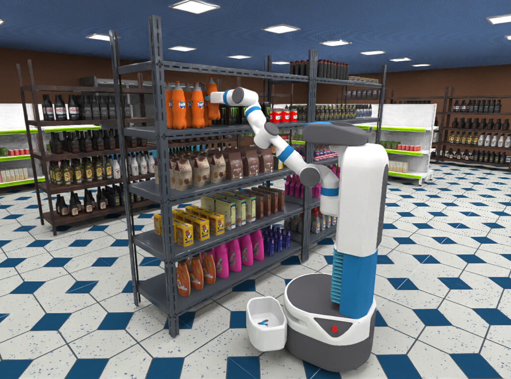

# RoboBenchMart

This repository contains code for data generation and robotic policy evaluation in the **RoboBenchMart** benchmark.
We present the `dsynth` (Darkstore Synthesizer) package, which includes specialized [ManiSkill](https://github.com/haosulab/ManiSkill) environments for retail setups, a scene generation algorithm, motion planning solvers for data collection, and scripts for policy evaluation.



## Installation

### Prerequisites

The ManiSkill simulator requires the Vulkan API.

```bash
sudo apt-get install libvulkan1
```

To test your Vulkan installation:
```bash
sudo apt install vulkan-tools
vulkaninfo
```

For troubleshooting, see the [ManiSkill installation guide](https://maniskill.readthedocs.io/en/latest/user_guide/getting_started/installation.html#troubleshooting).

### Installation from GitHub

```bash
git clone https://gitlab.2a2i.org/cv/robo/darkstore-synthesizer
cd darkstore-synthesizer
conda create -n dsynth python=3.10
conda activate dsynth
pip install -r requirements.txt
pip install mplib==0.2.1
```

To test your ManiSkill installation:
```bash
python -m mani_skill.examples.demo_random_action
```

### Downloading Assets

Download RoboCasa Assets:
```bash
python -m mani_skill.utils.download_asset RoboCasa
```

Download assets from [HuggingFace](https://huggingface.co/datasets/emb-ai/RoboBenchMart_assets):

```bash
hf download emb-ai/RoboBenchMart_assets --repo-type dataset --local-dir assets
```

### Downloading Demo Data (Optional)

If you do not plan to fine-tune your policy on RoboBenchMart training data (you can still generate it yourself from scratch) **or** evaluate it in training environments, you can skip this step.
Otherwise, download **demo data** from [HuggingFace](https://huggingface.co/datasets/emb-ai/RoboBenchMart_demo_envs):

```bash
hf download emb-ai/RoboBenchMart_demo_envs --repo-type dataset --local-dir demo_envs
```

## Sample Scene

Generate a simple scene:

```bash
python scripts/generate_scene_continuous.py ds_continuous=small_scene
```

The default save directory is `generated_envs/`, but you can change it using `ds_continuous.output_dir=<YOUR_PATH>`.

To visualize the generated environment in the SAPIEN viewer:

```bash
python scripts/show_env_in_sim.py generated_envs/ds_small_scene/ -s 42 --gui
```

The seed `-s` controls randomization of the scene layout, item arrangement, textures, and robot initial position.

## Teleoperation

You can use teleoperation to record demonstration trajectories:

```bash
python scripts/run_teleop_fetch.py --scene-dir generated_envs/ds_small_scene/
```

## Tutorials

See the [example notebook](notebooks/tutorial.ipynb) for tutorials on scene generation, importing scenes into ManiSkill, and motion planning using the `dsynth` package.

## RoboBenchMart Tasks

We present seven atomic and three composite tasks for evaluating mobile manipulation policies in retail environments.
These tasks can be grouped into two categories: **pick-and-place (PnP)** and **opening/closing**.

### Pick-and-Place Tasks

* **PickToBasket**: pick a specified item and place it in the attached basket  
* **MoveFromBoardToBoard**: move a specified item to the next board  
* **PickFromFloor**: pick an item from the floor and place it on a shelf

### Opening and Closing Tasks

* **Open Showcase** / **Close Showcase**: open or close a specified door of the vertical showcase  
* **Open Fridge** / **Close Fridge**: open or close the ice cream fridge door

Each task consists of two components:

* **ManiSkill environment** – defines the target object (for PnP), success criteria, robot initial position, and wall/ceiling textures  
* **Scene data** – defines layouts, objects present in the scenes, and their arrangement on shelves, which are imported into the ManiSkill environment during episode initialization

Thus, different target objects require different ManiSkill environments, and different item sets require distinct scene data.

Each atomic task is evaluated under the following setups:

* **Train scenes** – same scenes and target objects as used in training  
* **Train scenes with initial pose randomization** – same as training but with a different initial robot pose  
* **Test scenes** – unseen layouts and object arrangements, but seen target objects  
* **Out-of-distribution items** – unseen scenes and unseen target items (for PnP tasks only)

For more details, see the [task documentation](docs/tasks/README.md).

## Model Inference

### Finetuned Models

| Model | Description | Weights Downloading |
| ------- | -------------------------- | --------------------|
| Octo | [Octo-base](https://huggingface.co/emb-ai/RoboBenchMart_octo) finetuned with 1 history image and 50 action horizon | `hf download emb-ai/RoboBenchMart_octo --repo-type model --local-dir models/octo`
| $\pi_0$ | [Finetuned](https://huggingface.co/emb-ai/RoboBenchMart_pi0) $\pi_0$ | `hf download emb-ai/RoboBenchMart_pi0 --repo-type model --local-dir models/pi0` 
| $\pi_{0.5}$ | [Finetuned](https://huggingface.co/emb-ai/RoboBenchMart_pi05) $\pi_{0.5}$ | `hf download emb-ai/RoboBenchMart_pi05 --repo-type model --local-dir models/pi05` 

### Start Model Server

#### Octo

Follow the [official installation instructions](https://github.com/octo-models/octo) to set up the Octo environment.

Launch the Octo server (within the Octo environment):

```bash
python scripts/octo_server.py --model-path <PATH_TO_OCTO_WEIGHTS>
```

#### Pi0

Follow [original installation](https://github.com/Physical-Intelligence/openpi) instructions to set up environment with Pi0.

Apply a small patch to the Pi0 repository to add RoboBenchMart:
```
git apply path_to_robobenchmart/scripts/add_rbm.patch
```

Launch Pi0 (or Pi05) server (inside the Pi0 repository):

```bash
XLA_PYTHON_CLIENT_MEM_FRACTION=0.6 uv run scripts/serve_policy.py policy:checkpoint --policy.config=pi0_eval_rbm --policy.dir=<PATH_TO_Pi0_CHECKPOINT>
XLA_PYTHON_CLIENT_MEM_FRACTION=0.6 uv run scripts/serve_policy.py policy:checkpoint --policy.config=pi05_eval_rbm --policy.dir=<PATH_TO_Pi05_CHECKPOINT>
```


### Evaluation Example
##### Test Scenes (Unseen Layouts and Item Arrangements)

Generate test scenes (not needed if you have already downloaded **demo data**, as they are included):

```bash
bash bash/generate_test_scenes.sh
``` 

Run the evaluation client script `scripts/eval_policy_client.py`.
Example for evaluating in the `PickToBasketContNiveaEnv` environment with 30 rollouts:

```bash
python scripts/eval_policy_client.py -e PickToBasketContNiveaEnv --scene-dir demo_envs/test_unseen_items_pick_to_basket --eval-subdir policy_evaluation --max-horizon 500 --num-traj 30
```

To save videos for each rollout, add the `--save-video` flag.
Evaluation results will be saved in `demo_envs/test_unseen_items_pick_to_basket/evaluation/policy_evaluation`.
We recommend using different subdirectories (via `--eval-subdir`) for different policies to avoid mixing results.

Evaluation on tasks with **out-of-distribution target items** is done similarly, with the appropriate environment ID (`-e`) and scene directory (`--scene-dir`).
See the item distribution [here](docs/tasks/README.md).

##### Training Scenes (Seen Layouts and Arrangements)

To reproduce training environments for evaluation, you must specify the exact seeds used during trajectory collection (motion planning).
These seeds are stored in JSON files included in the **demo data** from [HuggingFace](https://huggingface.co/datasets/emb-ai/RoboBenchMart_demo_envs).  
Specify the path to these JSON files using `--json-path`:

```bash
python scripts/eval_policy_client.py --scene-dir demo_envs/pick_to_basket --json-path demo_envs/pick_to_basket/demos/motionplanning/pick_to_basket_stars_250traj_4workers.json --eval-subdir policy_evaluation --max-horizon 500 --num-traj 30
```

Note that `demo_envs/pick_to_basket` is a directory containing training scenes.

To evaluate a policy with additional randomization in the robot's initial position, specify a separate seed using `--robot-init-pose-start-seed 10000`.
Choose a large seed (>1000) to ensure the robot's starting position differs from the training setup.

### Run Full Evaluation

To run evaluations on seen, unseen, and out-of-distribution items (for Octo):

```bash
bash bash/eval_model.sh --model octo
```

For Pi0/Pi05:

```bash
bash bash/eval_model.sh --model pi0
```

```bash
bash bash/eval_model.sh --model pi05
```

### Evaluation on Composite Tasks

Generate scenes for composite tasks:

```bash
bash bash/generate_scenes_composite.sh
```

Evaluation for composite tasks uses the `scripts/eval_policy_composite_client.py` script, which has a similar interface:

```bash
python scripts/eval_policy_composite_client.py --env-id PickNiveaFantaEnv --scene-dir demo_envs/composite_pick_to_basket --eval-subdir policy_evaluation_composite --max-horizon 1000 --num-traj 30 --save-video
```

To run full evaluation on composite tasks (for Octo):

```bash
bash bash/eval_model_composite_tasks.sh --model octo
```

For Pi0/Pi05:

```bash
bash bash/eval_model_composite_tasks.sh --model pi0
```

```bash
bash bash/eval_model_composite_tasks.sh --model pi05
```

## Training Data

You can download raw h5 trajectories (~50Gb) collected via motion planning:

```bash
hf download emb-ai/RoboBenchMart_demo_envs_mp --repo-type dataset --local-dir demo_envs
```

Next, replay all trajectories to obtain visual observations:

```bash
bash bash/replay.sh
```

To convert data to RLDS format, refer to the [RLDS builder repository](https://github.com/emb-ai/DsynthAtomicTasks_rlds_builder).

## Training Dataset Generation

### From Demo Data

If you have already downloaded **demo data** from [HuggingFace](https://huggingface.co/datasets/emb-ai/RoboBenchMart_demo_envs), you need to collect demonstration trajectories.

First, run motion planning to collect raw `.h5` trajectories without visual observations in training environments:

```bash
bash bash/run_mp_all.sh
```

The resulting trajectories are stored in `../demos/motionplanning` within the scene directories.

Motion planning is time-consuming.
We recommend running per-environment scripts such as `bash/run_mp_CloseDoorFridgeContEnv.sh`, `bash/run_mp_MoveFromBoardToBoardVanishContEnv.sh`, etc., in parallel to accelerate trajectory generation.

Next, replay all trajectories to obtain visual observations:

```bash
bash bash/replay.sh
```

To convert data to RLDS format, refer to the [RLDS builder repository](https://github.com/emb-ai/DsynthAtomicTasks_rlds_builder).

### From Scratch

To generate demo data from scratch, first generate training scenes:

```bash
bash bash/generate_scenes.sh
```

The remaining steps are the same as above.